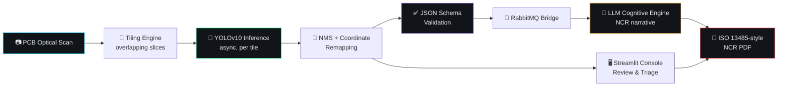

# VisiReportAI

**AI-Powered PCBA Defect Inspection & Compliance Reporting System**


---

## 📌 Overview

**VisiReport AI** is an end-to-end computer vision system for inspecting printed circuit board assemblies (PCBA). It detects **six classes of PCB defects** with a fine-tuned **YOLOv10** model, lets a quality engineer triage every detection in a human-in-the-loop registry, and exports a formal **non-conformance report (NCR) as a PDF** in the style of **ISO 13485:2016** (Cl. 8.3, 8.5.2).

The project has two halves:

| Part | What it is |
|---|---|
| 🧠 **Notebook** (`VisiReportAI.ipynb`) | Dataset prep, YOLOv10 training/validation, a tiled async vision engine, a JSON-Schema validator, a RabbitMQ message bridge and an LLM cognitive engine. |
| 🖥️ **Dashboard** (`visireport_dashboard.py`) | A dark, industrial-style Streamlit console for upload → inference → review → report export. |

---

## ✨ Features

- 🔍 **Defect detection** for 6 classes: open circuit, short circuit, mousebite, spur, spurious copper, pin-hole
- 🎯 **Fine-tuned YOLOv10** — `0.968 mAP@50` / `0.763 mAP@50-95`, trained on the DeepPCB dataset
- 🖼️ **OpenCV annotation** — colour-coded bounding boxes with class + confidence labels
- 🔬 **Zoom controls** (X / Y offset and up to 8× zoom) on the annotated board
- 🚦 **ISO-style severity tagging** — `CRITICAL` (open, short) · `MAJOR` (mousebite, spur, pin-hole) · `MINOR` (spurious copper)
- 🧑‍⚖️ **Human-in-the-loop defect registry** — filter by class / confidence / status, then **Confirm** or **Override** each detection
- ✅ **JSON-Schema validation** of every inspection payload (`jsonschema`)
- 📄 **Automated NCR PDF** generation with `fpdf2` — header, defect registry table, narrative and CAPA sections
- 📊 **Plotly dashboards** — class breakdown, severity donut, mAP convergence, per-class precision/recall, queue and cycle-time gauges
- 📥 **Audit-log CSV export**
- ⚙️ **Graceful fallback** — runs in *mock mode* with synthetic detections when no `best.pt` weights are present

---

## 🏗️ Architecture



---

## 🗂️ Dashboard Modules

| Tab | What it does |
|---|---|
| 🔎 **Inspection** | Upload a board scan (PNG / JPG / TIFF / BMP), run inference with a live terminal-style log, view the annotated board, zoom in, and see the severity summary charts. |
| 📋 **Defect Registry** | Filterable table of every detection plus a per-defect review panel with a zoomed crop, **Confirm** / **Override — false positive** actions, and engineer notes. |
| 🧠 **Cognitive Pipeline** | Shows the validated JSON payload, the drafted NCR narrative and suggested CAPA (containment, root cause, preventive). |
| 📄 **Compliance & Export** | Audit log with CSV export, one-click **NCR PDF** generation and download, queue/cycle-time gauges. |
| 📈 **System Performance** | Model metrics (mAP, precision, recall), convergence and per-class charts, plus a system-health panel. |

---

## 🧰 Tech Stack

<p>
  
</p>

| Area | Tools |
|---|---|
| Detection | YOLOv10 (Ultralytics), OpenCV, NumPy |
| UI | Streamlit, `streamlit-option-menu`, custom CSS, Plotly |
| Data & validation | Pandas, `jsonschema` |
| Reporting | `fpdf2` |
| Pipeline (notebook) | `asyncio`, `aio-pika` (RabbitMQ), `aiohttp`, Jinja2 |
| Training environment | Kaggle (GPU), DeepPCB dataset |

---

## 🚀 Getting Started

### 1. Clone

```bash
git clone https://github.com/HarshKhetan20/VisiReportAI.git
cd VisiReportAI
```

### 2. Install dependencies

```bash
python -m venv venv
# Windows: venv\Scripts\activate    |  macOS/Linux: source venv/bin/activate

pip install "streamlit>=1.35.0" streamlit-option-menu opencv-python-headless Pillow numpy pandas "plotly>=5.22.0" ultralytics fpdf2 pika jsonschema python-dateutil
```

### 3. Run the dashboard

```bash
streamlit run visireport_dashboard.py
```

The trained weights ship in the repo as **`best.pt`**. If the file is missing, the console falls back to **MOCK MODE** (synthetic detections) so the UI still works. You can also upload your own `.pt` weights from the sidebar.

### 4. Use it

1. Open **INSPECTION** and drop in a PCB scan.
2. Click **▶ INITIATE TILING INFERENCE**.
3. Review detections in **DEFECT REGISTRY** (confirm / override).
4. Open **COMPLIANCE & EXPORT** → **📄 GENERATE & DOWNLOAD NCR PDF**.

---

## 🎓 Model Training

Training lives in `VisiReportAI.ipynb` and was run on Kaggle (T4 GPU) using the **DeepPCB** dataset.

| Setting | Value |
|---|---|
| Base model | `yolov10s.pt` (Ultralytics) |
| Classes | `open`, `short`, `mousebite`, `spur`, `copper`, `pin-hole` |
| Epochs / early stop | 100 / patience 20 |
| Image size / batch | 640 / 16 |
| Optimizer | AdamW, `lr0=0.001`, `lrf=0.01`, weight decay `5e-4`, 3 warm-up epochs |
| Augmentation | HSV jitter, translate 0.1, scale 0.5, horizontal + vertical flip, mosaic 1.0, mixup 0.1 |
| Validation | `model.val(iou=0.7)` |

### 📈 Results

| Metric | Value |
|---|---|
| **mAP@50** | **0.968** |
| **mAP@50-95** | **0.763** |

<details>
<summary><b>🔬 Detected defect classes & severity mapping</b></summary>

<br/>

| Class | Display name | ISO severity |
|---|---|---|
| `open` | Open Circuit | 🔴 CRITICAL |
| `short` | Short Circuit | 🔴 CRITICAL |
| `mousebite` | Mousebite | 🟠 MAJOR |
| `spur` | Spur | 🟠 MAJOR |
| `pin-hole` | Pin-hole | 🟠 MAJOR |
| `copper` | Spurious Copper | 🟢 MINOR |

</details>

---

## 📁 Project Structure

```text
VisiReportAI/
├── visireport_dashboard.py     # Streamlit entry point (navigation + page setup)
├── config.py                   # Custom CSS, defect colours/names, Plotly theme, JSON schema
├── state.py                    # Streamlit session-state initialisation
├── utils.py                    # YOLO inference, OpenCV annotation, schema validation, PDF export
├── components/
│   └── sidebar.py              # System status, model upload, thresholds, queue monitor
├── tabs/
│   ├── inspection.py           # Upload, inference run, annotated viewport, summary charts
│   ├── defect_registry.py      # Filterable table + human-in-the-loop review
│   ├── cognitive_pipeline.py   # JSON payload, NCR narrative, CAPA cards
│   ├── compliance_export.py    # Audit log, CSV + PDF export, gauges
│   └── system_performance.py   # Model metrics and system health
├── VisiReportAI.ipynb          # Training + tiled vision engine + schema + MQ bridge + LLM client
└── best.pt                     # Fine-tuned YOLOv10 weights
```

---

## 🧭 Implementation Notes

A quick, honest map of what is live versus simulated in the current version:

| Component | Status |
|---|---|
| YOLOv10 inference with `best.pt` | ✅ Live (falls back to synthetic detections if weights are absent) |
| OpenCV annotation, zoom, defect triage, JSON-Schema validation | ✅ Live |
| NCR PDF generation (`fpdf2`) | ✅ Live |
| Tiled async inference + NMS (`PCBAVisionEngine`) | 🧪 Implemented in the notebook; the dashboard currently runs inference on the full image |
| RabbitMQ bridge (`aio-pika`, durable queue) | 🧪 Implemented in the notebook; shown as *simulated* in the dashboard |
| LLM narrative (`VisiSemanticClient` with retries and backoff) | 🧪 Implemented in the notebook with a mock response; the dashboard uses a templated narrative |
| Audit log, queue depth, system-health metrics | 🎭 Demo data |

---

## 🛣️ Roadmap

- [ ] Wire the tiled `PCBAVisionEngine` into the dashboard for 4K boards
- [ ] Connect a live RabbitMQ broker and a real LLM endpoint
- [ ] Persist the audit log (database) with authenticated engineer sign-off
- [ ] Add a `requirements.txt` and Dockerfile
- [ ] Batch inspection mode for multiple boards

---

## 👤 Author

**Harsh Khetan** — CSE (AI & ML), SRM Institute of Science & Technology

[LinkedIn](https://www.linkedin.com/in/harshkhetan20/) · [GitHub](https://github.com/HarshKhetan20) · [harshkhetan20@gmail.com](mailto:harshkhetan20@gmail.com)
